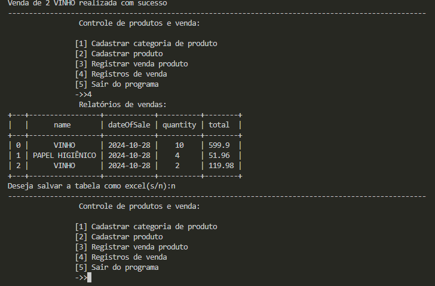

# product-sales-manager

Este projeto é um sistema de controle de produtos e vendas, desenvolvido em Python com SQLite como banco de dados. Ele permite gerenciar categorias de produtos, registrar novos produtos, registrar vendas e gerar relatórios das vendas realizadas. O sistema é executado via terminal e o objetivo do desenvolvimento é integrar um banco de dados, reforçando meus estudos em programação e manipulação de dados.

## Funcionalidades

- **Cadastrar Categoria de Produto**: Permite ao usuário adicionar novas categorias de produtos.
- **Cadastrar Produto**: Permite o registro de novos produtos, associando-os a uma categoria existente.
- **Registrar Venda de Produto**: O usuário pode registrar a venda de produtos, incluindo a quantidade vendida.
- **Relatórios de Vendas**: Gera relatórios que mostram detalhes das vendas, com a opção de exportar os dados para um arquivo Excel.
- **Validação de Entradas**: Inclui funções de validação para garantir que as entradas do usuário sejam corretas.

## Ferramentas

- **Linguagem**: Python
- **Banco de Dados**: SQLite
- **Bibliotecas**:
  - `sqlite3`: Para manipulação do banco de dados.
  - `pandas`: Para manipulação e exportação de dados.
  - `tabulate`: Para formatação de tabelas exibidas no console.

## Diagrama de Classes

  

## Modelagem de Dados

  

#

  
<strong>Códigos</strong>

  

      
      
      
  

  
<strong>Execução no terminal</strong>

  

      
    
  

#
Sinta-se à vontade para contribuir com melhorias ou adicionar novas funcionalidades!
